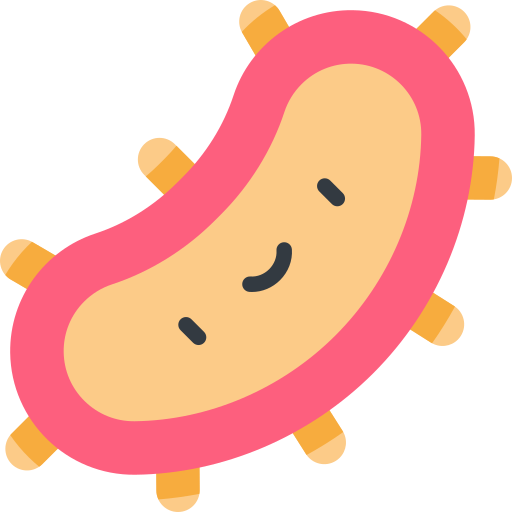

<h1 align="center">
    🧫 Life Engine
</h1>

    

    Small game about evolution of organisms written in Haskell

-   [Rules](#rules)
-   [Examples](#examples)
-   [Build](#build)

# Rules

## Cells

The world is a grid made up of square cells.
There can be different types of cells.
Organisms are structures of different anatomy cells.

### World cells:
-   **Empty cells** — cells that do nothing, they just exist. All other cells are created upon them. In the start of the game the world consists only of empty cells.
-   **Food** — a cell that can be eaten by an organism (using mouth). 

### Anatomy cells:

-   **Mouth** — the most important cell which eats food in directly adjacent coordinates. Every organism needs to eat as much food as there are cells in its body in order to reproduce. It's the only cell that is essential for every organism.
-   **Producer** — this cell generates food in adjacent cells. Every frame it has a small random chance of producing a food cell around it. That random chance can be tuned.
-   **Mover** — mover cell allows an organism to move and rotate randomly. Organism just needs one mover cell to move, adding more doesn't make it faster. Organisms with mover cells can't produce food even if they have producer cells, but it can be changed.
-   **Killer** — this cell harms other organisms when it touches them in directly adjacent cells
-   **Armor** — this cell defends against the killer cell simply by ignoring its damage.
-   **Eye** — the eye allows an organism to see and alter its movement based on its perceptions

## Lifecycle
The length of an organism's life is equal to number of its cells multiplied by lifespan multiplier (100 by default). For example, an organism made of 3 cells will die in 300 frames.

An organism transforms into **food** upon dying. 

Another way organisms can die is by being killed by a killer cell. When touched by a killer, the organism will take 1 damage. Once it gets as much as damage as its amount of cells, it will die. 

The larger the organism the harder to kill it, since it has more defense.

Once an organism eats more food than amount of its body cells it will reproduce. (the larger the organism the more food it needs to reproduce). 

An organism' offsprings are clones of an organism itself (they can born in any direction near the parent and can be rotated in any way). Reproduction can **fail** if an offspring tries to born in occupied space (food required to born an offspring vanishes as well). 

However, there is mutation possibility (see [Mutation](#mutation))

## Behavior
An organism requires one mover cell to move. Once, an organism has it, it starts to move in random direction, moving one cell per frame. After ***certain number of frames***, it will change its directon and rotation. (this number is called **move range** and can mutate over time).

Once an organism has both mover and eye cells, it obtains a ***brain***. The eye looks forward and and sees the first cells within a certain range. Then brain has three options:
1. Move away (only if it sees killer cell)
2. Move towards (only if it sees food)
3. Ignore (all other non-empty cells)

## Mutation
Information that defines makeup and behavior of the parent goes to its offspring. However, when born an offspring has a small chance to mutate in three different ways:
1. It can grow a new cell with a random type
2. It can change a type of already existing cell 
3. It can lose a cell (so, there can be organisms with gaps and cells disconnected from its body)

**If** an organism mutates it has 10% chance to alter other properties (movement range, brain decisions, probability of mutation itself)

## Examples

> Will be added later

## Build

Run
`cabal run`
to start the game
